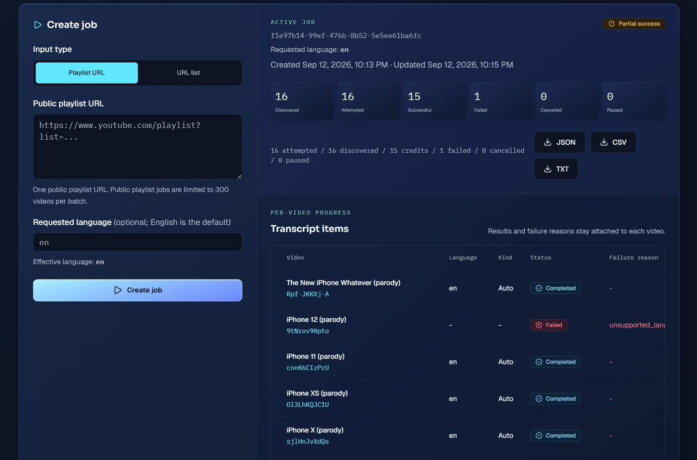
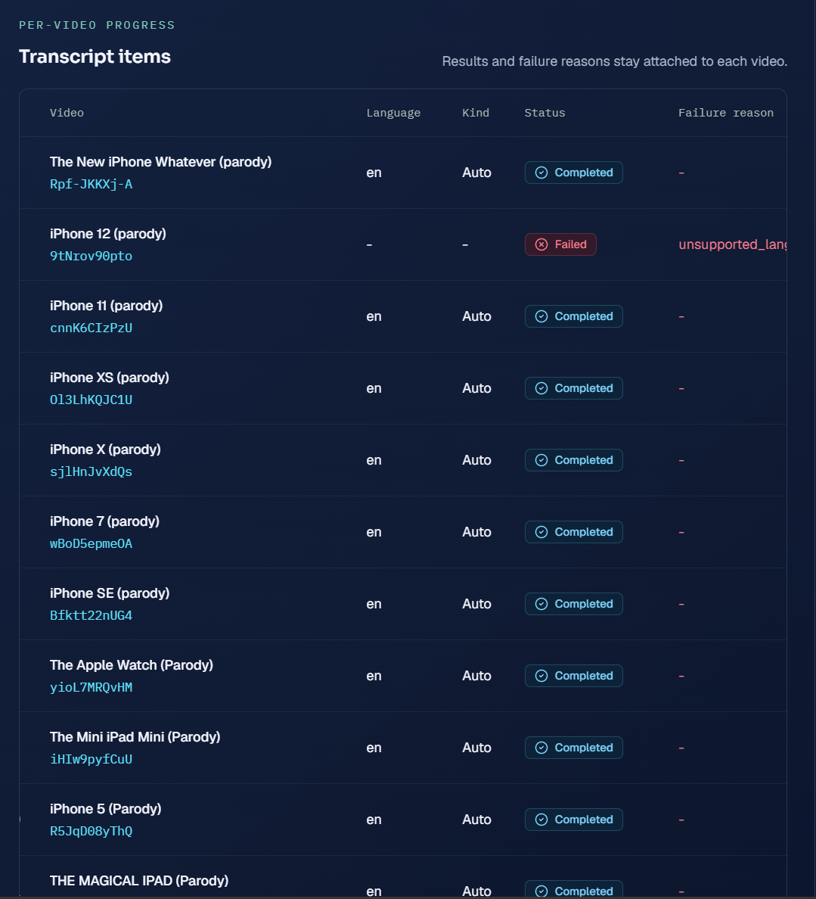

# TranscriptBatch API examples

Small working samples for the [TranscriptBatch API](https://transcriptapiyt.com/youtube-transcript-api). They submit a YouTube playlist or a list of video URLs, wait for the job to finish, and save the transcripts with metadata.

You need an API key first. Keys live in Settings on a paid plan, and each key is shown once when you create it. Keep it on your backend, never in frontend code.

## What the API does

One key, async jobs. You create a job with a playlist URL or a list of video URLs, poll it for status, then download the result as JSON, CSV or TXT. Playlist and URL list jobs handle up to 300 videos each. Every video keeps its own status, so a batch with a few bad videos still returns the rest. Videos that fail use zero credits.

Endpoints:

| Method | Endpoint | Use |
| ------ | -------- | --- |
| POST | `/api/v1/jobs` | Create a playlist or URL list job |
| GET | `/api/v1/jobs/[jobId]` | Poll status and per video progress |
| GET | `/api/v1/jobs/[jobId]/items` | List per video items with states |
| GET | `/api/v1/jobs/[jobId]/export?format=json` | Download JSON, CSV or TXT |

One rule that bites everyone the first time: every job creation needs a fresh `Idempotency-Key` header. Send a new UUID per deliberate submission. If you repeat the same key with the same payload you get the original job back instead of a new one.

## Examples

- `examples/python/playlist_to_json.py` — stdlib only, no pip packages needed. Creates a playlist job, polls until it completes, saves `transcripts.json`.
- `examples/node/playlist_to_json.mjs` — native fetch, needs Node 18 or newer. Same flow.

Both read the key from `TRANSCRIPTBATCH_API_KEY`:

```bash
export TRANSCRIPTBATCH_API_KEY="tbk_..."
python examples/python/playlist_to_json.py "https://www.youtube.com/playlist?list=PLxxxx"
```

```bash
export TRANSCRIPTBATCH_API_KEY="tbk_..."
node examples/node/playlist_to_json.mjs "https://www.youtube.com/playlist?list=PLxxxx"
```

## What a result looks like



Each returned transcript carries its video ID, language, status and timestamped segments, so chunks trace back to the exact source video. That is what makes the JSON export usable for RAG pipelines and search indexes directly.



## Limits worth knowing

- Only public videos and playlists. Private, deleted and region blocked videos come back labeled, not silent.
- English is the default requested language.
- Full contract: [OpenAPI document](https://transcriptapiyt.com/openapi/transcriptbatch-api-v1.yaml)
- Product pages: [bulk extractor](https://transcriptapiyt.com/bulk-youtube-transcripts) and [playlist downloader](https://transcriptapiyt.com/youtube-playlist-transcripts)
